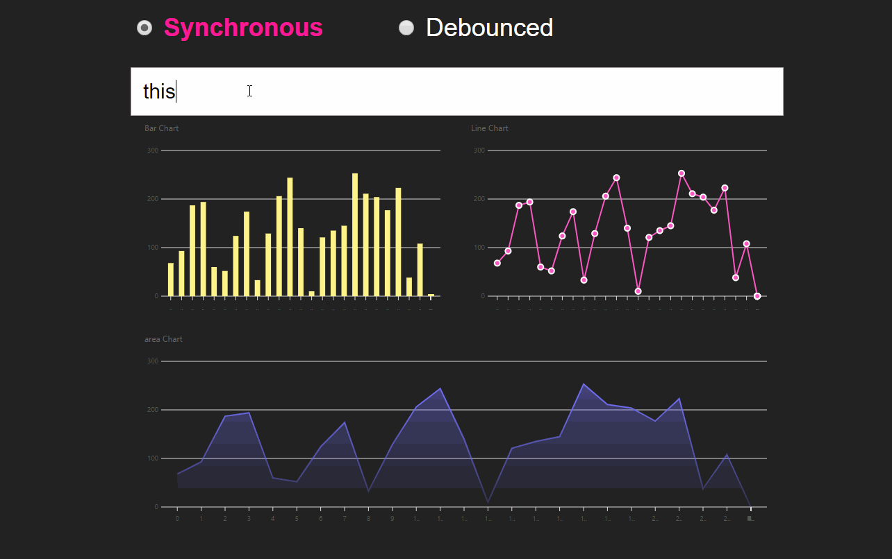

# Future Vue3.0 Time Slicing Support demo 

This is a demo application based on [Dan Abramov's](https://github.com/gaearon) recent [JSConf Iceland talk](https://reactjs.org/blog/2018/03/01/sneak-peek-beyond-react-16.html) about React.

This is a Vue version.

[VueConf link](https://vue.w3ctech.com/)



## Project setup
```
yarn install
```

### Compiles and hot-reloads for development
```
yarn run serve
```

### Compiles and minifies for production
```
yarn run build
```
### Customize configuration
See [Configuration Reference](https://cli.vuejs.org/config/).
